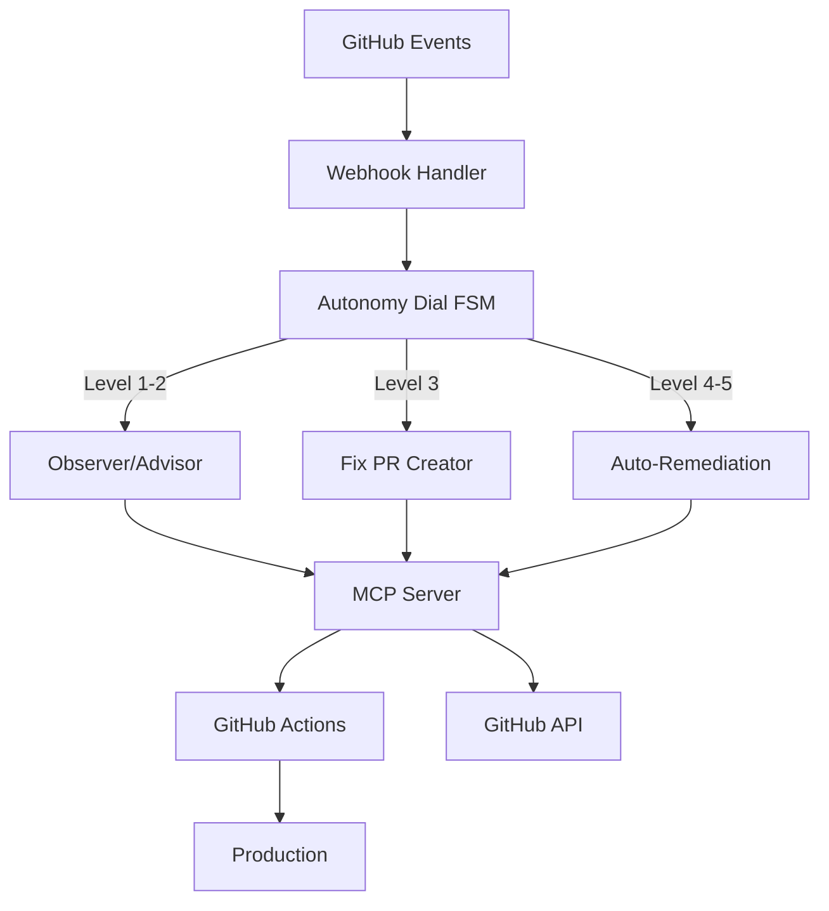

<div align="center">

# AgentCraftworks CE

**The open protocol layer for agentic DevOps**

[](LICENSE)
[](https://nodejs.org)
[](https://www.typescriptlang.org)
[](https://modelcontextprotocol.io)
[](https://github.com/Azure/AI-Dev-Days-Hackathon)

[Quick Start](#quick-start) · [How It Works](#how-it-works) · [Enterprise](#enterprise-edition) · [Early Adopters](#early-adopter-program) · [Docs](#documentation) · [Contribute](#contributing)

</div>

---

## The Problem

AI coding agents are powerful — but completely ungoverned. They merge PRs without approval, push to production without validation, and operate at full autonomy with no safety net.

**You need a governance layer that grows with your team's trust.**

## What AgentCraftworks CE Does

AgentCraftworks CE is a GitHub App + MCP server that intercepts every agent action and routes it through a **configurable Autonomy Dial** before it reaches your codebase.

```
Pull Request / Push Event
         ↓
  AgentCraftworks CE
         ↓
   Autonomy Dial (1–5)
    ├── Level 1: Alert only
    ├── Level 2: Suggest + comment  
    ├── Level 3: Create fix PR
    ├── Level 4: Auto-remediate
    └── Level 5: Full autonomous deploy
         ↓
  CODEOWNERS Routing → Assigned Agent
         ↓
   MCP Tool Execution
         ↓
    GitHub Actions
```

## Key Features

| Feature | Description |
|---|---|
| **Autonomy Dial** | 5-level governance control — set per-repo, per-team, per-event type |
| **MCP 6-Tool Interface** | Standard MCP server: analyze, fix, review, comment, rollback, escalate |
| **Finite State Machine** | Every agent action is a state transition — auditable, reproducible |
| **CODEOWNERS Routing** | Events routed to the right agent based on ownership rules |
| **Webhook Handling** | Handles GitHub PR, push, issue, and workflow events |
| **GitHub App Scaffold** | Drop-in GitHub App: one install, works across all repos in your org |

## Architecture



## Quick Start

```bash
# Requirements: Node.js 22+, GitHub App credentials
git clone https://github.com/AgentCraftworks/AgentCraftworks-CE.git
cd AgentCraftworks-CE/typescript
npm install

# Configure environment
cp .env.example .env
# Add your GitHub App credentials (see docs/setup.md)

# Build and start
npm run build
npm start
```

**Webhook endpoint:** `POST /api/webhook`  
**Health check:** `GET /health`  
**MCP tools:** `GET /mcp/tools`

## How It Works

### 1. Autonomy Dial
Every repo gets an autonomy level (1–5). The dial determines what the agent is allowed to do:

- **Level 1 – Observer:** Watch and alert. No action taken.
- **Level 2 – Advisor:** Post comments and suggestions.
- **Level 3 – Peer Programmer:** Open fix PRs for human review.
- **Level 4 – Agent Team:** Auto-remediate with human escalation fallback.
- **Level 5 – Full Agent Team:** Fully autonomous including deploy.

### 2. Finite State Machine
Every incoming event follows a deterministic state machine:
`RECEIVED → CLASSIFIED → GOVERNANCE_CHECK → ROUTED → EXECUTING → COMPLETE`

This makes every agent action **auditable and reproducible** — essential for enterprise compliance.

### 3. MCP-Compatible
CE ships a fully compliant Model Context Protocol (MCP) server. Any MCP-capable AI client (GitHub Copilot, Claude, GPT-4) can connect and use the 6 core tools directly.

## Enterprise Edition

AgentCraftworks Enterprise adds the reliability and governance layer that production teams need:

| Capability | CE | Enterprise |
|---|:---:|:---:|
| Autonomy Dial (1–5) | ✅ | ✅ |
| MCP 6-tool interface | ✅ | ✅ |
| Webhook + FSM routing | ✅ | ✅ |
| CODEOWNERS routing | ✅ | ✅ |
| **SRE Incident Response** | ❌ | ✅ |
| **Self-Healing Orchestrator** | ❌ | ✅ |
| **CI Autofix Engine** | ❌ | ✅ |
| **Chronicle AI Audit Ledger** | ❌ | ✅ |
| **Governance Monitor** | ❌ | ✅ |
| **Azure Monitor Integration** | ❌ | ✅ |
| **Real-time Dashboard** | ❌ | ✅ |
| **Copilot Agent Dispatch** | ❌ | ✅ |
| **Enterprise Source Access (ESAP)** | ❌ | ✅ Add-on |
| SLA + dedicated support | ❌ | ✅ |

**→ [Talk to us about Enterprise](mailto:enterprise@agentcraftworks.io)**

## Early Adopter Program

**We're looking for 5–10 platform engineering teams to beta test AgentCraftworks.**

Early adopters get:
- Free CE access + **90-day free Enterprise Beta** (invite only)
- Direct channel with the founding team
- Early adopter badge + attribution in docs

→ **[Sign up here](https://github.com/AgentCraftworks/AgentCraftworks-CE/issues/new?template=early-adopter-signup.yml)** or see the [Early Adopter Program docs](docs/early-adopters.md) for full details.

## Documentation

- [Setup Guide](docs/setup.md)
- [Autonomy Dial Reference](docs/autonomy-dial.md)
- [MCP Tool Reference](docs/mcp-tools.md)
- [Architecture Overview](docs/architecture.md)
- [Early Adopter Program](docs/early-adopters.md)
- [Contributing Guide](CONTRIBUTING.md)

## Contributing

We welcome contributions! Please read our [Contributing Guide](CONTRIBUTING.md) first — all contributors must sign our [CLA](.github/CLA.md).

```bash
# Run tests
cd typescript && npm test

# Lint
npm run lint
```

## License

MIT License — Copyright (c) 2025 AICraftworks LLC

See [LICENSE](LICENSE) for full text.

---

<div align="center">

Built with ❤️ for the agentic DevOps era · Powered by Azure + GitHub Copilot

[Enterprise](mailto:enterprise@agentcraftworks.io) · [Early Adopters](https://github.com/AgentCraftworks/AgentCraftworks-CE/issues/new?template=early-adopter-signup.yml) · [Issues](../../issues) · [Discussions](../../discussions)

</div>