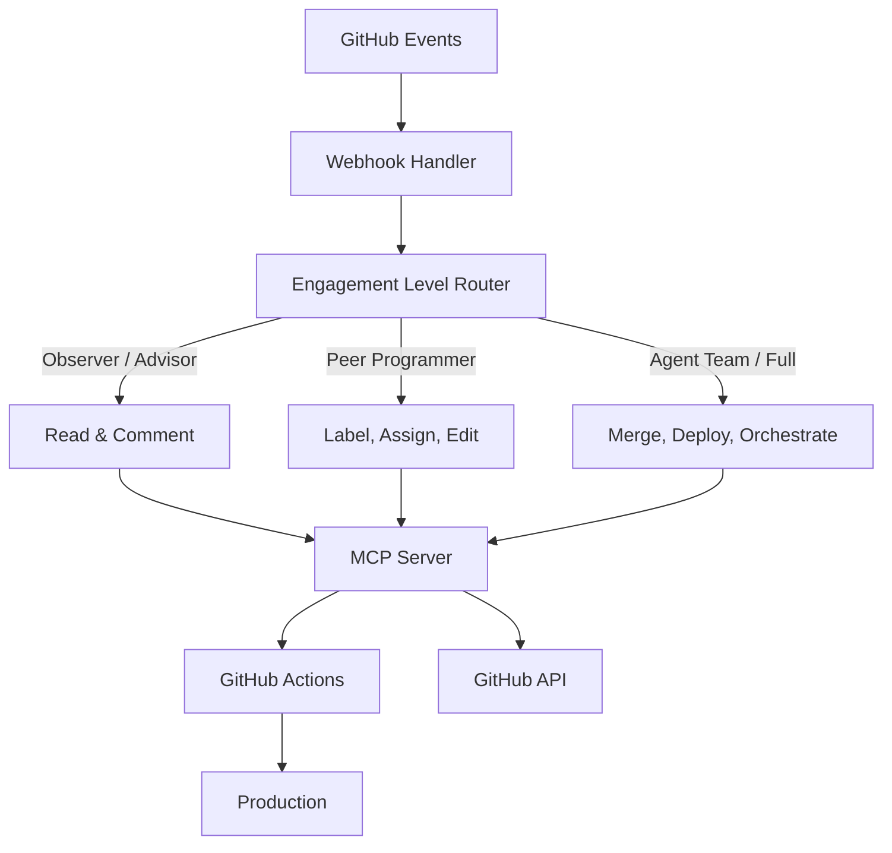

<div align="center">

# AgentCraftworks Community Edition

**The open protocol layer for agentic DevOps**

[](LICENSE)
[](https://nodejs.org)
[](https://www.typescriptlang.org)
[](https://modelcontextprotocol.io)
[](https://github.com/Azure/AI-Dev-Days-Hackathon)

[Quick Start](#quick-start) · [How It Works](#how-it-works) · [Enterprise](#enterprise-edition) · [Docs](#documentation) · [Contribute](#contributing)

</div>

---

## The Problem

AI coding agents are powerful — but completely ungoverned. They merge PRs without approval, push to production without validation, and operate at full autonomy with no safety net.

**Engineering teams need an agent team operating at the speed of their trust while ensuring critical security and compliance requirements are always met.**

## What AgentCraftworks Community Edition Does

AgentCraftworks Community Edition is a GitHub App + MCP server that intercepts every agent action and routes it through **configurable Agent Engagement Levels** before it reaches your codebase. AgentCraftworks provides the governance layer that even when your team leverages the full agent team in their practices the human is always in the loop for Production. 

## SDLC Lifecycle Strategy

AgentCraftworks Community Edition supports teams across multiple SDLC phases, from brand-new product idea to production-ready governance.

- Prototype quickly with low policy friction
- Introduce staging and validation checks as solutions mature
- Enforce productized promotion flow (`feature/* -> staging -> main`)
- Operate production repos with explicit governance and incident-aware workflows

See `docs/SDLC_LIFECYCLE_STRATEGY.md` for the lifecycle model and phased policy/infrastructure guidance.

```
Pull Request / Push Event
         ↓
  AgentCraftworks Community Edition
         ↓
   Agent Engagement Levels (1–5)
    ├── Observer (T1):        Read, view, list
    ├── Advisor (T2):         Comment, suggest
    ├── Peer Programmer (T3): Label, assign, approve, edit file
    ├── Agent Team (T4):      Merge, close, create branch, push commit
    └── Full Agent Team (T5): Deploy, modify CI, orchestrate agents
         ↓
  CODEOWNERS Routing → Assigned Agent
         ↓
   MCP Tool Execution
         ↓
    GitHub Actions
```

## Key Features

| Feature | Description |
|---|---|
| **Agent Engagement Levels** | 5-level governance control (Observer → Full Agent Team) — set per-repo, per-team, per-event type |
| **MCP 6-Tool Interface** | Standard MCP server: analyze, fix, review, comment, rollback, escalate |
| **Finite State Machine** | Every agent action is a state transition — auditable, reproducible |
| **CODEOWNERS Routing** | Events routed to the right agent based on ownership rules |
| **Webhook Handling** | Handles GitHub PR, push, issue, and workflow events |
| **GitHub App Scaffold** | Drop-in GitHub App: one install, works across all repos in your org |

## Architecture


```mermaid
graph TD
    GH[GitHub Events] --> WH[Webhook Handler]
    WH --> AD[Engagement Level Router]
    AD -->|Observer / Advisor| OBS[Read & Comment]
    AD -->|Peer Programmer| PR[Label, Assign, Edit]
    AD -->|Agent Team / Full| AUTO[Merge, Deploy, Orchestrate]
    OBS --> MCP[MCP Server]
    PR --> MCP
    AUTO --> MCP
    MCP --> GHA[GitHub Actions]
    MCP --> API[GitHub API]
    GHA --> PROD[Production]
```

## Quick Start

```bash
# Requirements: Node.js 22+, GitHub App credentials
git clone https://github.com/AgentCraftworks/AgentCraftworks-CE.git
cd AgentCraftworks-CE/typescript
npm install

# Configure environment
cp .env.example .env
# Add your GitHub App credentials (see Quick Start section above)

# Build and start
npm run build
npm start
```

**Webhook endpoint:** `POST /api/webhook`  
**Health check:** `GET /health`  
**MCP tools:** `GET /mcp/tools`

## How It Works

### 1. Agent Engagement Levels
Every repo gets an engagement level (1–5). The level determines what the agent is permitted to do:

| Level | Name | Action Tier | Permitted Actions |
|-------|------|-------------|-------------------|
| 1 | Observer | T1 | Read, view, list |
| 2 | Advisor | T2 | Comment, suggest |
| 3 | Peer Programmer | T3 | Label, assign, approve, edit file |
| 4 | Agent Team | T4 | Merge, close, create branch, push commit |
| 5 | Full Agent Team | T5 | Deploy, modify CI, orchestrate agents |

Environment caps: local=5, dev=5, staging=4, production=3

### 2. Finite State Machine
Every incoming event follows a deterministic state machine:
`RECEIVED → CLASSIFIED → GOVERNANCE_CHECK → ROUTED → EXECUTING → COMPLETE`

This makes every agent action **auditable and reproducible** — essential for enterprise compliance.

### 3. MCP-Compatible
AgentCraftworks Community Edition ships a fully compliant Model Context Protocol (MCP) server. Any MCP-capable AI client (GitHub Copilot, Claude, GPT-4) can connect and use the 6 core tools directly.

## Enterprise Edition

AgentCraftworks also powers enterprise deployments with additional incident response automation, self-healing orchestration, and governance monitoring. Learn more at [AgentCraftworks.com](https://agentcraftworks.com).

## Fork & Customize

AgentCraftworks CE is MIT-licensed — you can fork it and run your own instance, with or without rebranding.

- **Keep the name?** You still need your own GitHub App credentials, Azure subscription, and CODEOWNERS teams.
- **Rename it?** The MIT license requires preserving the copyright notice, but you're free to rebrand everything else.

See the **[Fork & Rename Guide](FORKING.md)** for a complete file-by-file checklist.

## Documentation

- [Quick Start Guide](#quick-start)
- [Fork & Rename Guide](FORKING.md)
- [Agent Engagement Levels Reference](docs/architecture.md#agent-engagement-levels-reference)
- [MCP Tool Reference](docs/architecture.md)
- [Architecture Overview](docs/architecture.md)
- [SDLC Lifecycle Strategy](docs/SDLC_LIFECYCLE_STRATEGY.md)
- [Accessibility Capability](docs/accessibility.md)
- [Contributing Guide](CONTRIBUTING.md)

## Contributing

We welcome contributions! Please read our [Contributing Guide](CONTRIBUTING.md) first — all contributors must sign our [CLA](.github/CLA.md).

```bash
# Run tests
cd typescript && npm test

# Lint
npm run lint
```

## License

MIT License — Copyright (c) 2025 AICraftworks LLC

See [LICENSE](LICENSE) for full text.

---

<div align="center">

Built with ❤️ for the agentic DevOps era · Powered by Azure + GitHub Copilot

[Enterprise](https://agentcraftworks.com) · [Issues](../../issues) · [Discussions](../../discussions)

</div>
