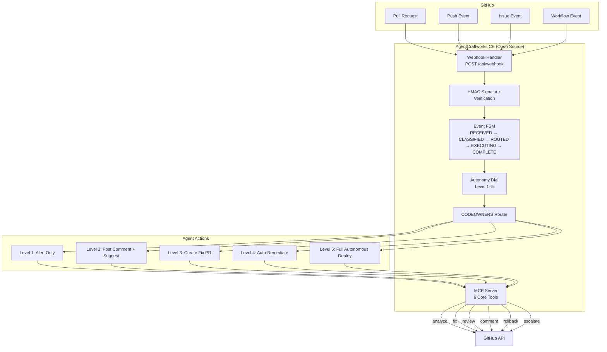
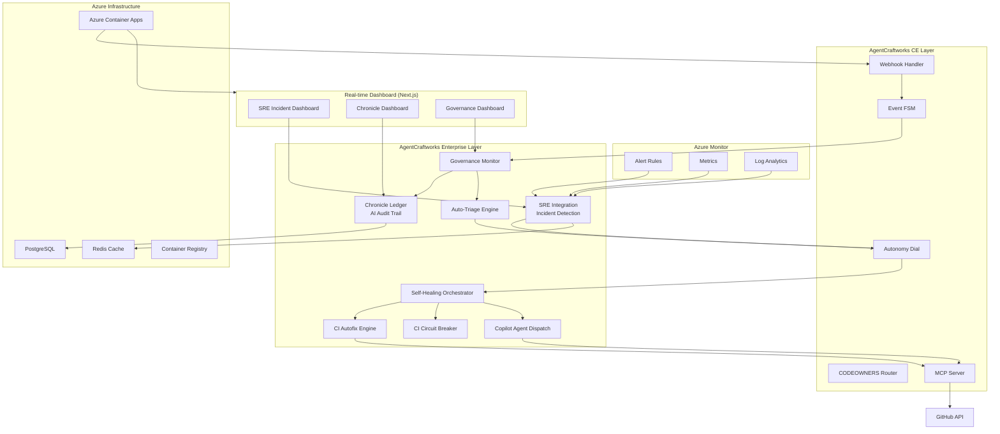
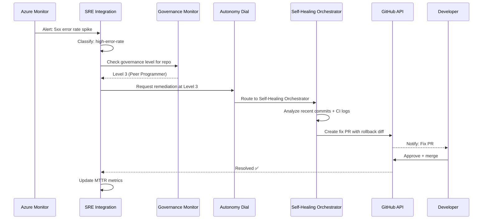

# AgentCraftworks Architecture

This document describes the full end-to-end architecture of AgentCraftworks — from GitHub events to agentic remediation.

## Community Edition Architecture



## Enterprise Architecture (Full Stack)



## Data Flow: SRE Incident to Resolution



## Autonomy Dial Reference

| Level | Name | Allowed Actions | Human Required |
|---|---|---|---|
| 1 | Observer | Alert, log | Always |
| 2 | Advisor | Comment, suggest fix | Always |
| 3 | Peer Programmer | Open fix PR | For merge |
| 4 | Agent Team | Auto-merge, rollback | Escalation only |
| 5 | Full Agent Team | Deploy, scale, remediate | Never |

## Deployment: Azure Container Apps

```
                    ┌─────────────────────────────────┐
                    │     Azure Container Apps Env     │
                    │                                 │
  GitHub ────────▶ │  AgentCraftworks (Container)    │
                    │     Port 3000                   │
                    │                                 │
                    │  Next.js Dashboard (Container)  │
                    │     Port 3000                   │
                    └──────────┬──────────────────────┘
                               │
              ┌────────────────┼────────────────┐
              ▼                ▼                ▼
         PostgreSQL          Redis            Azure
         Flexible           Cache          Container
          Server                           Registry
```

## CE vs Enterprise: Component Map

| Component | CE | Enterprise |
|---|:---:|:---:|
| `webhook-handler.ts` | ✅ | ✅ (extended) |
| `autonomy-dial.ts` | ✅ | ✅ (extended) |
| `event-fsm.ts` | ✅ | ✅ (extended) |
| `mcp-server.ts` | ✅ | ✅ (extended) |
| `codeowners-router.ts` | ✅ | ✅ |
| `handoff-service.ts` | ✅ | ✅ (3KB larger) |
| `sre-integration.ts` | ❌ | ✅ |
| `self-healing-orchestrator.ts` | ❌ | ✅ |
| `ci-autofix-engine.ts` | ❌ | ✅ |
| `chronicle-*.ts` | ❌ | ✅ |
| `governance-monitor.ts` | ❌ | ✅ |
| `copilot-agent-dispatch.ts` | ❌ | ✅ |
| `incident-manager.ts` | ❌ | ✅ |
| `alert-service.ts` | ❌ | ✅ |
| Next.js Dashboard | ❌ | ✅ |
| Azure Bicep Infra | ❌ | ✅ |