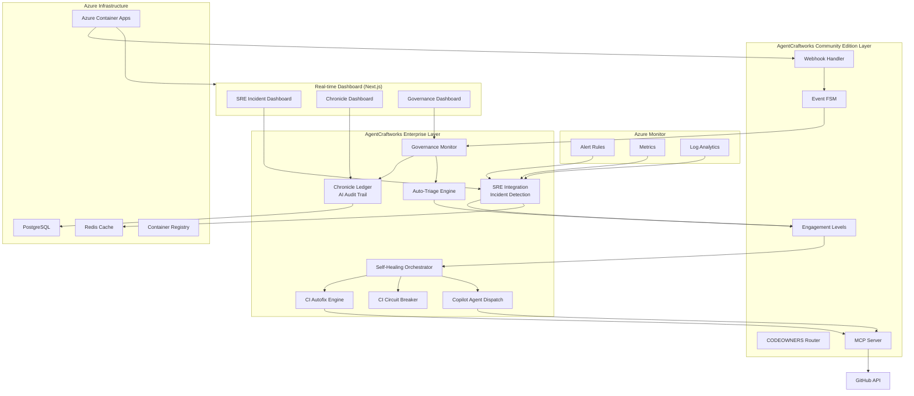
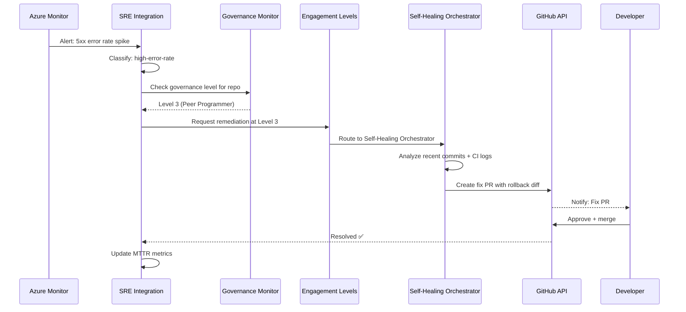

# AgentCraftworks Architecture

This document describes the full end-to-end architecture of AgentCraftworks — from GitHub events to agentic remediation.

## Community Edition Architecture

```mermaid
graph TD
    subgraph GitHub["GitHub"]
        PR[Pull Request]
        PUSH[Push Event]
        ISSUE[Issue Event]
        WF[Workflow Event]
    end

    subgraph CE["AgentCraftworks Community Edition (Open Source)"]
        WH[Webhook Handler<br/>POST /api/webhook]
        AUTH[HMAC Signature Verification]
        FSM[Event FSM<br/>RECEIVED → CLASSIFIED → ROUTED → EXECUTING → COMPLETE]
        AD[Agent Engagement Levels<br/>Observer → Full Agent Team]
        COD[CODEOWNERS Router]
        MCP[MCP Server<br/>6 Core Tools]
    end

    subgraph Actions["Agent Actions"]
        L1[Observer \(T1\): Read, view, list]
        L2[Advisor \(T2\): Comment, suggest]
        L3[Peer Programmer \(T3\): Label, assign, approve, edit file]
        L4[Agent Team \(T4\): Merge, close, create branch, push commit]
        L5[Full Agent Team \(T5\): Deploy, modify CI, orchestrate agents]
    end

    PR --> WH
    PUSH --> WH
    ISSUE --> WH
    WF --> WH
    WH --> AUTH
    AUTH --> FSM
    FSM --> AD
    AD --> COD
    COD --> L1
    COD --> L2
    COD --> L3
    COD --> L4
    COD --> L5
    L1 --> MCP
    L2 --> MCP
    L3 --> MCP
    L4 --> MCP
    L5 --> MCP
    MCP -->|analyze| GH_API[GitHub API]
    MCP -->|fix| GH_API
    MCP -->|review| GH_API
    MCP -->|comment| GH_API
    MCP -->|rollback| GH_API
    MCP -->|escalate| GH_API
```

## Enterprise Architecture (Full Stack)


```mermaid
graph TD
    subgraph AzureMonitor["Azure Monitor"]
        AM_ALERTS[Alert Rules]
        AM_METRICS[Metrics]
        AM_LOGS[Log Analytics]
    end

    subgraph CE["AgentCraftworks Community Edition Layer"]
        WH[Webhook Handler]
        FSM[Event FSM]
        AD[Engagement Levels]
        COD[CODEOWNERS Router]
        MCP[MCP Server]
    end

    subgraph Enterprise["AgentCraftworks Enterprise Layer"]
        SRE[SRE Integration<br/>Incident Detection]
        SHO[Self-Healing Orchestrator]
        CI_FIX[CI Autofix Engine]
        CI_CB[CI Circuit Breaker]
        GOV[Governance Monitor]
        CHRON[Chronicle Ledger<br/>AI Audit Trail]
        COPILOT[Copilot Agent Dispatch]
        TRIAGE[Auto-Triage Engine]
    end

    subgraph Dashboard["Real-time Dashboard (Next.js)"]
        SRE_DASH[SRE Incident Dashboard]
        CHRON_DASH[Chronicle Dashboard]
        GOV_DASH[Governance Dashboard]
    end

    subgraph AzureInfra["Azure Infrastructure"]
        ACA[Azure Container Apps]
        PG[PostgreSQL]
        REDIS[Redis Cache]
        ACR[Container Registry]
    end

    AM_ALERTS --> SRE
    AM_METRICS --> SRE
    AM_LOGS --> SRE
    SRE --> AD
    AD --> SHO
    SHO --> CI_FIX
    SHO --> CI_CB
    SHO --> COPILOT
    CI_FIX --> MCP
    COPILOT --> MCP
    MCP --> GH_API[GitHub API]
    WH --> FSM
    FSM --> GOV
    GOV --> CHRON
    GOV --> TRIAGE
    TRIAGE --> AD
    CHRON --> PG
    SRE --> REDIS
    ACA --> WH
    ACA --> Dashboard
    SRE_DASH --> SRE
    CHRON_DASH --> CHRON
    GOV_DASH --> GOV
```

## Data Flow: SRE Incident to Resolution


```mermaid
sequenceDiagram
    participant AM as Azure Monitor
    participant SRE as SRE Integration
    participant GOV as Governance Monitor
    participant AD as Engagement Levels
    participant SHO as Self-Healing Orchestrator
    participant GH as GitHub API
    participant DEV as Developer

    AM->>SRE: Alert: 5xx error rate spike
    SRE->>SRE: Classify: high-error-rate
    SRE->>GOV: Check governance level for repo
    GOV-->>SRE: Level 3 (Peer Programmer)
    SRE->>AD: Request remediation at Level 3
    AD->>SHO: Route to Self-Healing Orchestrator
    SHO->>SHO: Analyze recent commits + CI logs
    SHO->>GH: Create fix PR with rollback diff
    GH-->>DEV: Notify: Fix PR #42 opened by AgentCraftworks
    DEV->>GH: Approve + merge
    GH-->>SRE: Resolved ✅
    SRE->>SRE: Update MTTR metrics
```

## Agent Engagement Levels Reference

| Level | Name | Action Tier | Permitted Actions | Human Required |
|---|---|---|---|---|
| 1 | Observer | T1 | Read, view, list | Always |
| 2 | Advisor | T2 | Comment, suggest | Always |
| 3 | Peer Programmer | T3 | Label, assign, approve, edit file | For merge |
| 4 | Agent Team | T4 | Merge, close, create branch, push commit | Escalation only |
| 5 | Full Agent Team | T5 | Deploy, modify CI, orchestrate agents | Never |

Environment caps: local=5, dev=5, staging=4, production=3

## Deployment: Azure Container Apps

```
                    ┌─────────────────────────────────┐
                    │     Azure Container Apps Env     │
                    │                                 │
  GitHub ────────▶ │  AgentCraftworks (Container)    │
                    │     Port 3000                   │
                    │                                 │
                    │  Next.js Dashboard (Container)  │
                    │     Port 3000                   │
                    └──────────┬──────────────────────┘
                               │
              ┌────────────────┼────────────────┐
              ▼                ▼                ▼
         PostgreSQL          Redis            Azure
         Flexible           Cache          Container
          Server                           Registry
```

## CE vs Enterprise: Component Map

| Component | CE | Enterprise |
|---|:---:|:---:|
| `webhook-handler.ts` | ✅ | ✅ (extended) |
| `engagement-levels.ts` | ✅ | ✅ (extended) |
| `event-fsm.ts` | ✅ | ✅ (extended) |
| `mcp-server.ts` | ✅ | ✅ (extended) |
| `codeowners-router.ts` | ✅ | ✅ |
| `handoff-service.ts` | ✅ | ✅ (3KB larger) |
| `sre-integration.ts` | ❌ | ✅ |
| `self-healing-orchestrator.ts` | ❌ | ✅ |
| `ci-autofix-engine.ts` | ❌ | ✅ |
| `chronicle-*.ts` | ❌ | ✅ |
| `governance-monitor.ts` | ❌ | ✅ |
| `copilot-agent-dispatch.ts` | ❌ | ✅ |
| `incident-manager.ts` | ❌ | ✅ |
| `alert-service.ts` | ❌ | ✅ |
| Next.js Dashboard | ❌ | ✅ |
| Azure Bicep Infra | ❌ | ✅ |