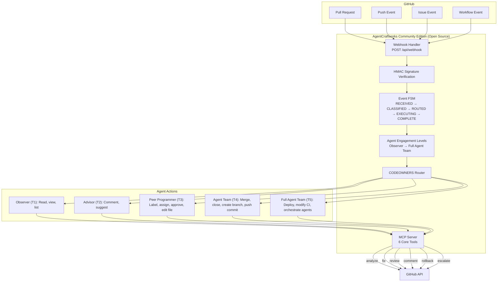

# AgentCraftworks Architecture

This document describes the full end-to-end architecture of AgentCraftworks — from GitHub events to agentic remediation.

## SDLC Lifecycle Context

Architecture decisions in this repository align to a staged SDLC strategy:

- Greenfield ideation and rapid prototyping
- Validation and staging hardening
- Productized promotion flow and governance
- Production operations and incident response

See `docs/SDLC_LIFECYCLE_STRATEGY.md` for the lifecycle model and when to activate stricter repo policy and infrastructure controls.

## Community Edition Architecture

```mermaid
graph TD
    subgraph GitHub["GitHub"]
        prEvent["Pull Request"]
        pushEvent["Push Event"]
        issueEvent["Issue Event"]
        workflowEvent["Workflow Event"]
    end

    subgraph CE["AgentCraftworks Community Edition (Open Source)"]
        webhookHandler["Webhook Handler<br/>POST /api/webhook"]
        signatureVerify["HMAC Signature Verification"]
        eventFsm["Event FSM<br/>RECEIVED → CLASSIFIED → ROUTED → EXECUTING → COMPLETE"]
        engagementLevels["Agent Engagement Levels<br/>Observer → Full Agent Team"]
        codeownersRouter["CODEOWNERS Router"]
        mcpServer["MCP Server<br/>6 Core Tools"]
    end

    subgraph Actions["Agent Actions"]
        level1["Observer (T1): Read, view, list"]
        level2["Advisor (T2): Comment, suggest"]
        level3["Peer Programmer (T3): Label, assign, approve, edit file"]
        level4["Agent Team (T4): Merge, close, create branch, push commit"]
        level5["Full Agent Team (T5): Deploy, modify CI, orchestrate agents"]
    end

    prEvent --> webhookHandler
    pushEvent --> webhookHandler
    issueEvent --> webhookHandler
    workflowEvent --> webhookHandler
    webhookHandler --> signatureVerify
    signatureVerify --> eventFsm
    eventFsm --> engagementLevels
    engagementLevels --> codeownersRouter
    codeownersRouter --> level1
    codeownersRouter --> level2
    codeownersRouter --> level3
    codeownersRouter --> level4
    codeownersRouter --> level5
    level1 --> mcpServer
    level2 --> mcpServer
    level3 --> mcpServer
    level4 --> mcpServer
    level5 --> mcpServer
    mcpServer -->|analyze| ghApi["GitHub API"]
    mcpServer -->|fix| ghApi
    mcpServer -->|review| ghApi
    mcpServer -->|comment| ghApi
    mcpServer -->|rollback| ghApi
    mcpServer -->|escalate| ghApi
```

## Agent Engagement Levels Reference

| Level | Name | Action Tier | Permitted Actions | Human Required |
|---|---|---|---|---|
| 1 | Observer | T1 | Read, view, list | Always |
| 2 | Advisor | T2 | Comment, suggest | Always |
| 3 | Peer Programmer | T3 | Label, assign, approve, edit file | For merge |
| 4 | Agent Team | T4 | Merge, close, create branch, push commit | Escalation only |
| 5 | Full Agent Team | T5 | Deploy, modify CI, orchestrate agents | Never |

Environment caps: local=5, dev=5, staging=4, production=3